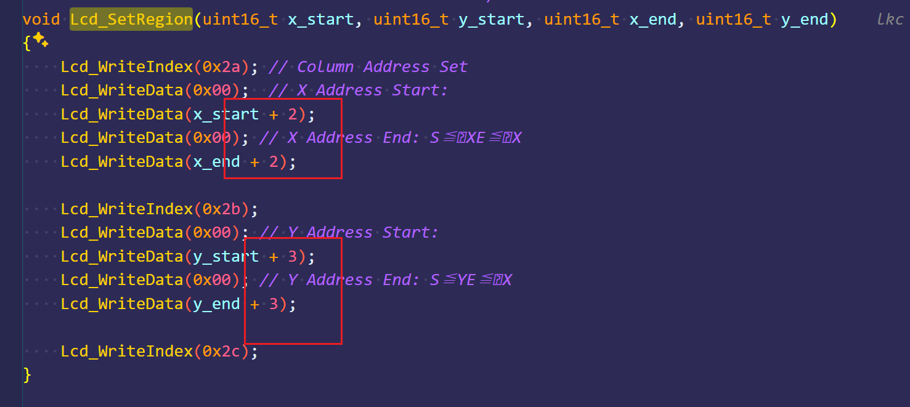
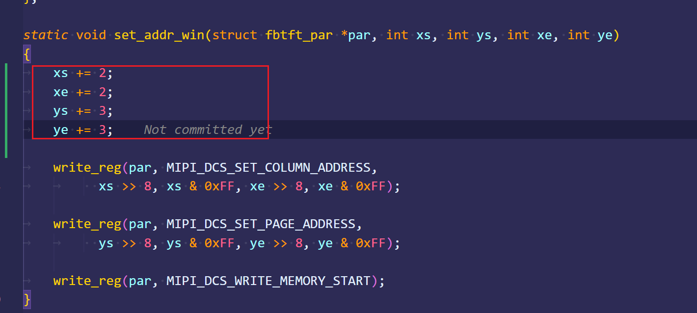

测试fb设备：

**cat** /dev/urandom **>** /dev/fb0   测试花屏

**cat** /dev/zero **>** /dev/fb0 测试清屏

模组：1.44 spi屏幕

遇到的问题:

1. x , y 起使方向 都有一两条 花屏
   查看自带的屏幕demo 发现其实设置点是有偏移的

查看驱动
默认的fb_st7735r 没有偏移

2. 两角各有一个点 为花屏

设备树中 新增bgr参数，修复
