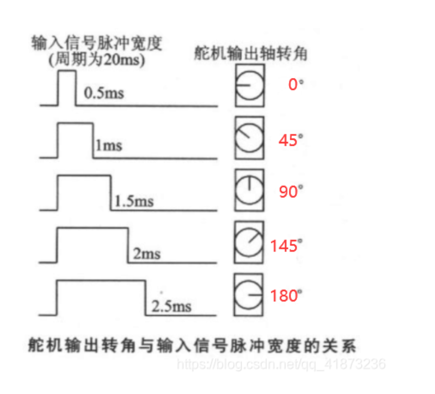

操作电机：

导出pwm 通道0：不能重复导出

echo 0 > /sys/class/pwm/pwmchip10/export

周期：！！！注意这里，一开始以为这里是1ns 占空比 1000就是1ms，实际这个只是周期，设置为20ms

echo 20000000 > /sys/class/pwm/pwmchip10/pwm0/period

占空比：实际上这个也是周期长度，占电平的时间

占空比：0.5

echo 500000 > duty_cycle

echo 1000000 > duty_cycle

echo 1500000 > duty_cycle

echo 2000000 > duty_cycle

echo 2500000 > duty_cycle

极性

**echo**"normal"**>** /sys/class/pwm/pwmchip1/pwm0/polarity
echo**"inversed"**>** /sys/class/pwm/pwmchip1/pwm0/polarity**

开关pwm

echo 1 > /sys/class/pwm/pwmchip1/pwm0/enable
echo 0 > /sys/class/pwm/pwmchip1/pwm0/enable

取消导出

echo 0 > /sys/class/pwm/pwmchip10/unexport
