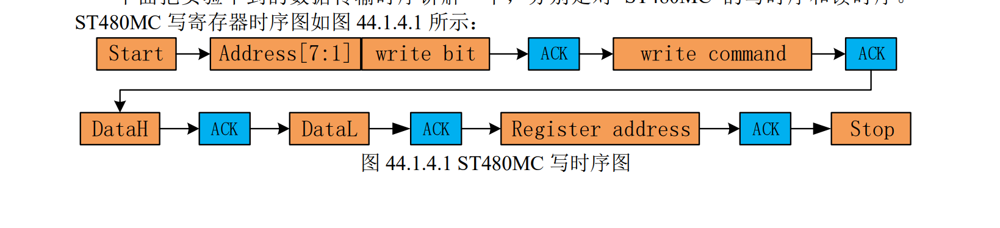
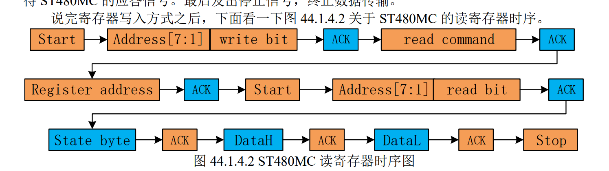
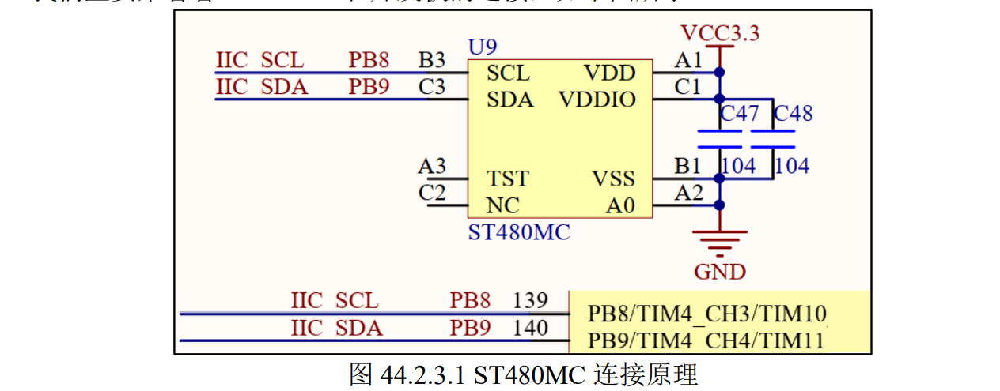

ST480MC 是一款由 Sendia 公司生产的三轴电子磁力计，内部进行信号处理，通过 IIC 接口
进行输出。ST480MC 提供的输出信号与它在 XYZ 方向上测量的磁场成比例，如果需要消除比
例因子，需要用户自行校准。ST480MC 主要特点如下：
1）测量范围：最大±48 高斯
2）高分辨率：0.15μT/LSB(X/Y 轴)，0.25μT/LSB(Z 轴)
3）高灵敏度：X/Y 轴灵敏度：667 LSBs/Gauss，Z 轴灵敏度：400 LSBs/Gauss
4）工作温度范围：-40~+85℃
5）供电电压：2.2~3.6V
6）16 位 ADC 采样
7）内部带有温度传感器
8）支持中断

