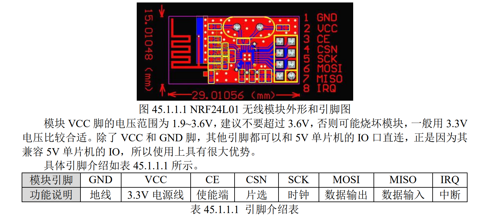

NRF24L01 无线模块，采用的芯片是 **NRF24L01**+。该芯片是由 NORDIC 公司生产，并且集
成 NORDIC 自家的 Enhance ShortBurst 协议，主要特点如下：
1）2.4G 全球开放的 ISM 频段，免许可证使用
2）最高工作速率 2Mbps，高效的 GFSK 调制，抗干扰能力强
3）126 个可选的频道，满足多点通信和调频通信的需要
4）6 个数据通道可支持点对多点的通信地址控制
5）低工作电压（1.9~3.6V）
6）硬件 CRC 和自动处理字头
7）可设置自动应答，确保数据可靠传输
由于高速信号是由芯片内部的射频协议处理后进行无线高速通信，对 MCU 的时钟频率要
求不高，只需要对 NRF24L01 某些寄存器进行配置即可。芯片与外部 MCU 是通过 SPI 通信接
口进行数据通信，并且最大的 SPI 速度可达 **10MHz**。
这个芯片是 NRF24L01 的升级版。相比 NRF24L01，升级版支持 250k，1M，2M 三种传输
速率；支持更多种功率配置，根据不同应用有效节省功耗；稳定性及可靠性更高

